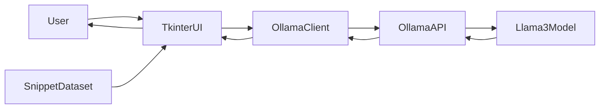
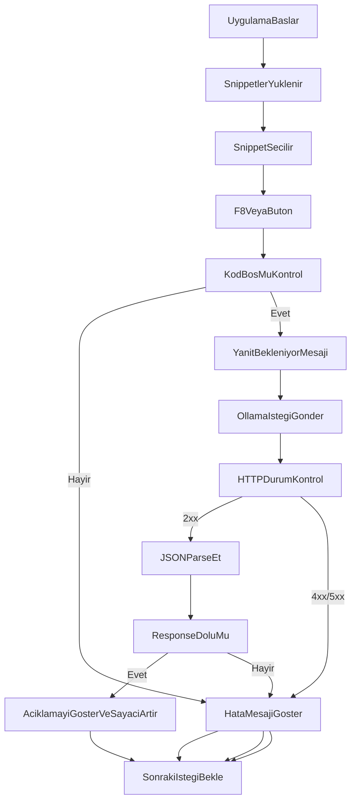

# AI Asistan (F8 Menu)

Bu proje, secili metni `F8` ile alip Ollama uzerinden farkli islemler yapan bir masaustu yardimcisidir.  
Kopyalanan metin; ceviri, gramer duzeltme, ozetleme, resmi dile cevirme gibi komutlarla aninda islenir.



## 1) Proje Ozeti

Uygulama su ihtiyaclari cozer:

- Secili metni tek tusla (`F8`) hizli isleme
- Ollama ile lokal AI destekli metin donusumu
- Sonucu otomatik olarak panoya/aktif alana yapistirma
- Belirli islemlerde sonucu ayri pencerede gosterme

Desteklenen islem tipleri:

- Gramer duzeltme
- Ingilizceye/Turkceye ceviri
- Madde madde ozet
- Daha resmi yaziya donusturme
- Python kodu uretme
- Mail cevap taslagi
- PS5 skor + yorum formati

### Akis Semasi



## 2) Teknik Mimari

Proje tek dosya merkezli ama fonksiyonlara ayrilmis bir yapi kullanir:

- UI/etkilesim: `tkinter` (gizli root, popup menu, mesaj kutulari)
- Global kisayol: `pynput` (`F8`)
- Metin alma/yapistirma: `pyautogui` + `pyperclip`
- Servis katmani: `ollama_cevap_al(...)` ile HTTP istekleri (`requests`)
- Asenkron GUI guvenligi: `queue.Queue` + `root.after(...)`

## 3) Calisma Akisi

1. Kullanici herhangi bir uygulamada metin secer.
2. `F8` ile menu acilir.
3. Islem secilir.
4. Secili metin prompt ile birlestirilir.
5. Ollama API (`/api/generate`) cagrilir.
6. Sonuc:
   - Cogu komutta aktif alana otomatik yapistirilir.
   - PS5 komutunda ayri bir sonuc penceresinde gosterilir.

## 4) Kurulum ve Calistirma

### Gereksinimler

- Windows
- Python 3.10+
- Ollama kurulu ve calisir durumda
- En az bir uygun model (ornek: `llama3-preview:latest`)

### En kolay yol (onerilen)

1. Bu klasorde `BASLAT.bat` dosyasini cift tikla calistir.
2. Script gerekiyorsa `kurulum.bat` ile `.venv` ve paketleri otomatik kurar.
3. Sonrasinda `main.pyw` acilir ve uygulama arka planda dinlemeye baslar.

Asagidaki sekans diyagrami, bir ceviri isteginin UI'dan modele kadar nasil aktigini gosterir:

### Manuel yol (terminal)

```powershell
python -m venv .venv
.\.venv\Scripts\activate
pip install -r requirements.txt
python .\main.pyw
```

### Ollama model kontrolu

```powershell
ollama list
```

Gerekirse model yukle:

```powershell
ollama pull llama3-preview:latest
```

## 5) Kullanim Rehberi

1. Herhangi bir uygulamada metni sec.
2. `F8` tusuna bas.
3. Acilan menuden islemi sec.
4. Sonucu aktif alanda veya popup pencerede gor.

## 6) Hata Yonetimi ve Troubleshooting

Yaygin durumlar:

- Ollama baglanti hatasi: `http://localhost:11434` ayakta olmayabilir
- Model bulunamadi: secili model cihazda kurulu degil
- Bos secim: metin secmeden `F8` basildi

Hizli kontrol:

```powershell
curl http://localhost:11434/api/tags
```

Port kontrol:

```powershell
netstat -ano | findstr 11434
```

## 7) Dosya Yapisi

```text
.
├── BASLAT.bat
├── kurulum.bat
├── main.pyw
├── requirements.txt
└── README.md
```

## 8) Notlar

- Varsayilan API adresi: `http://localhost:11434/api/generate`
- Varsayilan model adayi: `llama3-preview:latest`
- Uygulama metni yerel makinede isler; cloud API cagrisi yapmaz (Ollama lokal ise)
